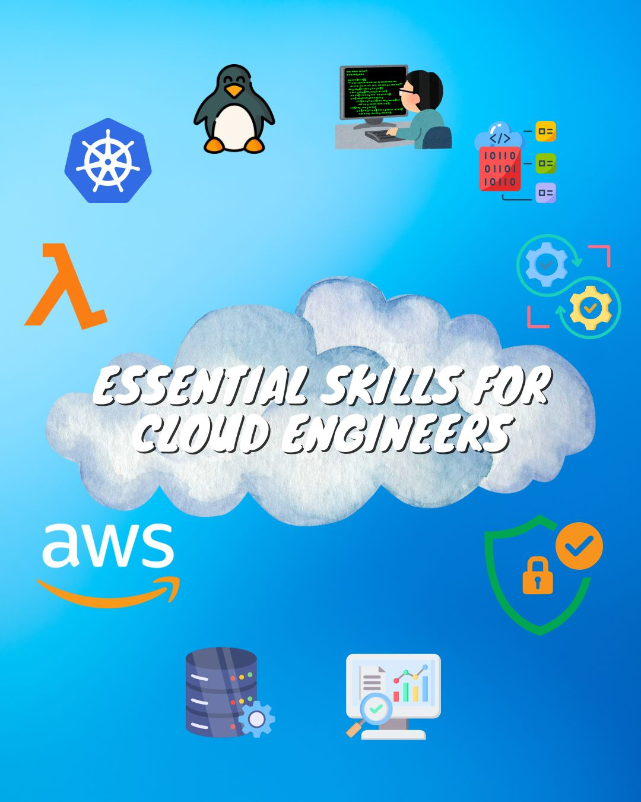

# 10 MUST have skills for every aspiring Cloud Engineer 

Fonte/link/Original post: https://www.linkedin.com/posts/thoughtfultechy_10-must-have-skills-for-every-aspiring-cloud-activity-7273233535602237441-TDFc

> ## 1. Linux/Unix 
- Proficiency in Linux/Unix systems is crucial, as many cloud platforms and services are based on these operating systems. 

- Skills in shell scripting, file system management, and system administration are highly valued. 
 
`Resource:` https://lnkd.in/gzW5PxDZ

> ## 2. Programming and Scripting 
 
- Proficiency in at least one high-level programming language (e.g., Python, Java, Go). 

- Scripting skills for automation (e.g., Bash, PowerShell). 

- Familiarity with RESTful APIs and web services. 
 
`Resource:` https://lnkd.in/gnFWnk-j 
 
> ## 3. Cloud Platforms 
 
- In-depth knowledge of at least one major cloud platform: 
 - Amazon Web Services (AWS) 

- Understanding of cloud services, deployment models, and best practices. 
 
`Resource:` https://lnkd.in/gwEuyGku 
 
> ## 4. Infrastructure as Code (IaC) 
 
- Proficiency in tools like Terraform and CloudFormation 
 
`Resource:` https://lnkd.in/gq3-DZm6 
 
> ## 5. Containerization and Orchestration 
 
- Kubernetes for container orchestration. 

- Understanding of microservices architecture. 
 
`Resource:` https://lnkd.in/gnvag98u 
 
> ## 6. CI/CD and DevOps Practices 
 
- Familiarity with CI/CD pipelines and tools ( 

- Understanding of DevOps principles and practices. 
 
`Resource:` https://lnkd.in/gfr_hMmu 
 
> ## 7. Security 
 
- Knowledge of cloud security best practices. 

- Understanding of identity and access management (IAM). 

- Familiarity with encryption and compliance standards. 
 
`Resource:` https://lnkd.in/gjtYFSQ7 
 
> ## 8. Monitoring and Logging 
 
- Experience with monitoring tools (e.g., Prometheus, Grafana). 

- Understanding of log management and analysis. 
 
`Resource:` https://lnkd.in/g-pUTFDq 
 
> ## 9. Database Management 
 
- Knowledge of both SQL and NoSQL databases to start 

- Understanding of database scaling and optimization in cloud environments. 
 
`Resource:` https://lnkd.in/gpJUtGUx 
 
> ## 10. Serverless Computing 
 
- Understanding of serverless architecture and its benefits. 

- Familiarity with AWS Lambda and other serverless services. 
 
`Resource:` https://lnkd.in/dK8Aghf 
 

