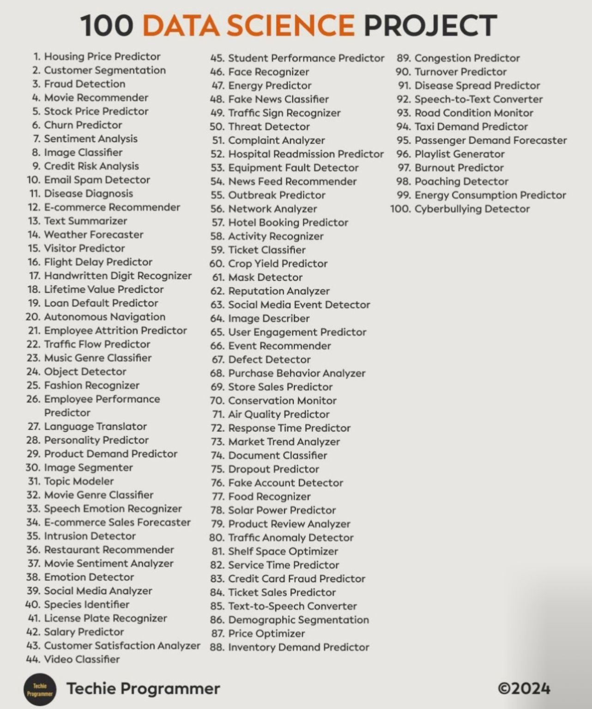

# 𝗧𝗼𝗽 𝟭𝟬𝟬 𝗗𝗮𝘁𝗮 𝗦𝗰𝗶𝗲𝗻𝗰𝗲 𝗣𝗿𝗼𝗷𝗲𝗰𝘁𝘀 𝗙𝗼𝗿 𝗕𝗲𝗴𝗶𝗻𝗻𝗲𝗿𝘀 𝘁𝗼 𝗔𝗱𝘃𝗮𝗻𝗰𝗲𝗱 (𝗣𝗮𝗿𝘁 𝟭)

[Link / Fonte](https://www.linkedin.com/posts/iamarifalam_%F0%9D%97%A7%F0%9D%97%BC%F0%9D%97%BD-%F0%9D%9F%AD%F0%9D%9F%AC%F0%9D%9F%AC-%F0%9D%97%97%F0%9D%97%AE%F0%9D%98%81%F0%9D%97%AE-%F0%9D%97%A6%F0%9D%97%B0%F0%9D%97%B6%F0%9D%97%B2%F0%9D%97%BB%F0%9D%97%B0%F0%9D%97%B2-%F0%9D%97%A3%F0%9D%97%BF%F0%9D%97%BC%F0%9D%97%B7%F0%9D%97%B2%F0%9D%97%B0%F0%9D%98%81%F0%9D%98%80-activity-7259438790769823744-63lD?utm_source=share&utm_medium=member_desktop)

 

➊ Data Analysis on Titanic Dataset
Level: Beginner
Skills: Data cleaning, visualization
Dataset: https://lnkd.in/dhZHti_W

➋ Customer Segmentation Using Clustering
Level: Beginner
Skills: K-means, clustering analysis
Dataset: https://lnkd.in/gEMWyRec

➌ Predicting House Prices
Level: Intermediate
Skills: Regression, feature engineering
Dataset: https://lnkd.in/d735Ek7P

➍ Sentiment Analysis of Movie Reviews
Level: Intermediate
Skills: Text processing, NLP
Dataset: https://lnkd.in/gs7FgiHc

➎ Sales Forecasting for Retail Stores
Level: Intermediate
Skills: Time series analysis, forecasting
Dataset: https://lnkd.in/gKFgVeJp

➏ Image Classification with CIFAR-10
Level: Intermediate
Skills: Deep learning, CNNs
Dataset: https://lnkd.in/gdge-EcU

➐ Loan Default Prediction
Level: Advanced
Skills: Classification, imbalanced data handling
Dataset: https://lnkd.in/gBqGDXV9

➑ Fraud Detection in Transactions
Level: Advanced
Skills: Anomaly detection, fraud analysis
Dataset: https://lnkd.in/gqVQ9WXY

➒ Stock Market Prediction Using LSTM
Level: Advanced
Skills: Time series, LSTM networks
Dataset: https://lnkd.in/gDHNBRmq

➓ Recommender System for E-commerce
Level: Advanced
Skills: Collaborative filtering, matrix factorization
Dataset: https://lnkd.in/gtTvSrBQ

⓫ Web Traffic Time Series Forecasting
Level: Intermediate
Skills: Time series, seasonal decomposition
Dataset: https://lnkd.in/gwTFUDY7

⓬ Heart Disease Prediction
Level: Intermediate
Skills: Classification, medical data analysis
Dataset: https://lnkd.in/gCvCTeux

⓭ Speech Emotion Recognition
Level: Advanced
Skills: Audio processing, machine learning
Dataset: https://lnkd.in/gCC-4-sf

⓮ Human Activity Recognition Using Smartphones
Level: Intermediate
Skills: Classification
Dataset: https://lnkd.in/gmCfPhxW

⓯ Twitter Sentiment Analysis
Level: Beginner
Skills: Text processing
Dataset: https://lnkd.in/ggsi6ryi

---

📕 400+ 𝗗𝗮𝘁𝗮 𝗦𝗰𝗶𝗲𝗻𝗰𝗲 𝗥𝗲𝘀𝗼𝘂𝗿𝗰𝗲𝘀: https://lnkd.in/gv9yvfdd

📘 𝗣𝗿𝗲𝗺𝗶𝘂𝗺 𝗗𝗮𝘁𝗮 𝗦𝗰𝗶𝗲𝗻𝗰𝗲 𝗜𝗻𝘁𝗲𝗿𝘃𝗶𝗲𝘄 𝗥𝗲𝘀𝗼𝘂𝗿𝗰𝗲𝘀 : https://lnkd.in/gPrWQ8is

📙 𝗣𝘆𝘁𝗵𝗼𝗻 𝗗𝗮𝘁𝗮 𝗦𝗰𝗶𝗲𝗻𝗰𝗲 𝗟𝗶𝗯𝗿𝗮𝗿𝘆: https://lnkd.in/gHSDtsmA

📗 45+ 𝗠𝗮𝘁𝗵𝗲𝗺𝗮𝘁𝗶𝗰𝘀 𝗕𝗼𝗼𝗸𝘀 𝗘𝘃𝗲𝗿𝘆 𝗗𝗮𝘁𝗮 𝗦𝗰𝗶𝗲𝗻𝘁𝗶𝘀𝘁 𝗡𝗲𝗲𝗱𝘀: https://lnkd.in/ghBXQfPc

---
